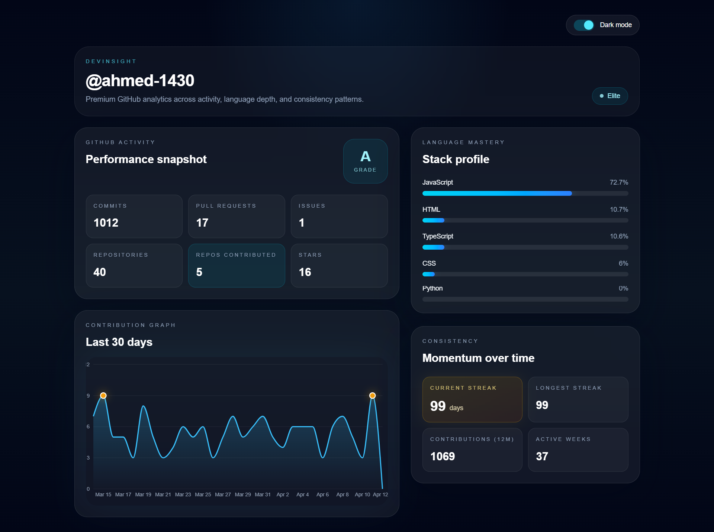

#  DevInsight Frontend

A modern, responsive SaaS dashboard that visualizes GitHub activity in a clean and interactive way.

##  Live Demo
👉 https://github-analytics-black.vercel.app/

---

##  Preview

---

##  Features

-  GitHub analytics dashboard (commits, PRs, issues)
-  Contribution streak tracking
-  Interactive contribution graph (last 30 days)
-  Language usage breakdown
-  Activity status & grade system
-  Auto dark/light mode
-  Smooth animations (Framer Motion)
-  Fully responsive (mobile → desktop)

---

##  Tech Stack

- **Next.js (App Router)**
- **TypeScript**
- **Tailwind CSS**
- **Framer Motion**
- **Recharts**

---

##  API Integration

Connected with custom backend:
